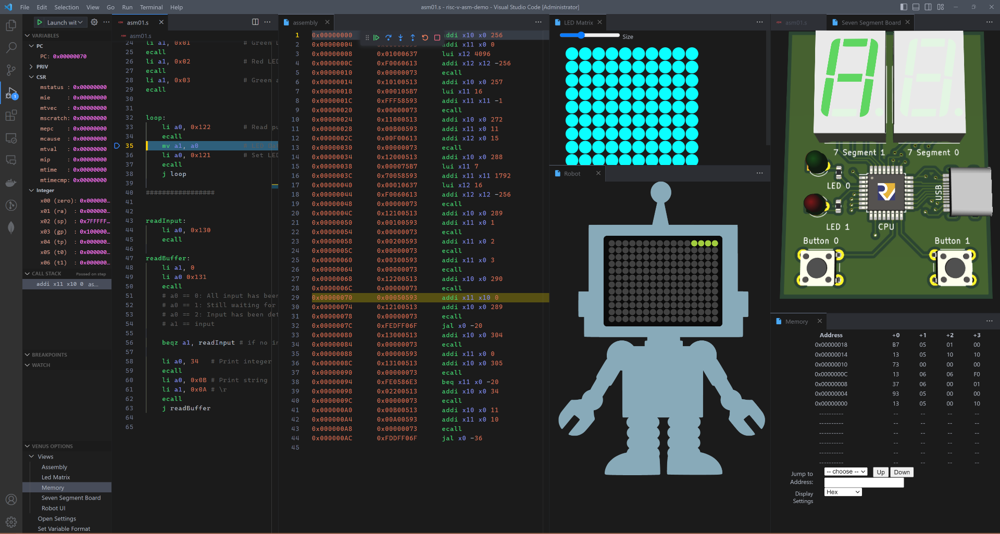

# Embedded System I
## RISC-V Assembly Language Programming

### Playlist:
https://www.youtube.com/playlist?list=PLBPFpqyTjzeU8jpwZz2wLRCzuLZBm3LkM

### Examples:
All examples can be found in the `asm` directory.

---

